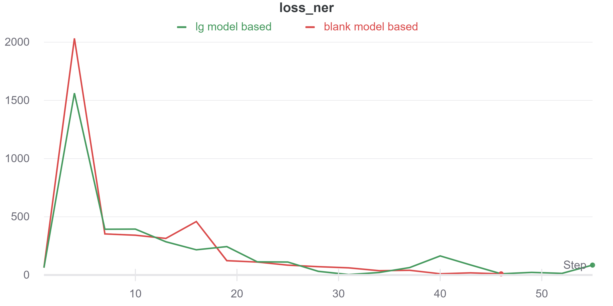
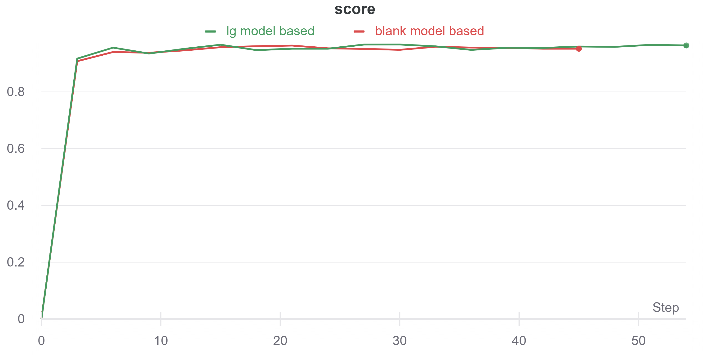

# Named Entity Recognition NER using spaCy ver3
Named Entity Recognition using CLI training process

## Repo includes folowing config files to train models:
```
-config_demo_acc (lg model based)
-config_demo_efficiency (train from empty)
-config_demo_transformer (trf model based)
```
*config files use wandb as logger 
*details about training and tests processes provided in NER_de_training.ipynb notebook

### Model usage
```
-trained models include best checkpoint (checkpoint setting can be changed in config files)
-to run model use "spacy.load(path_to_model)"
-in the repo provided smallest and simpliest model 
```
### Report plots



### Prerequisites
```
-spaCy
-sklearn
```


## License

This project is licensed under the MIT License - see the [LICENSE](LICENSE) file for details
